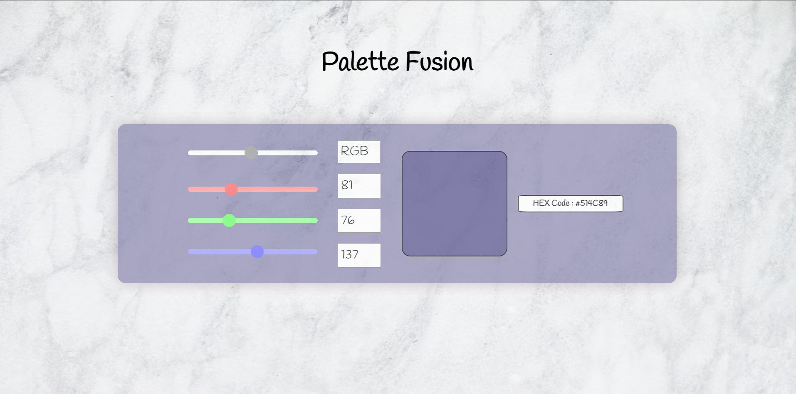
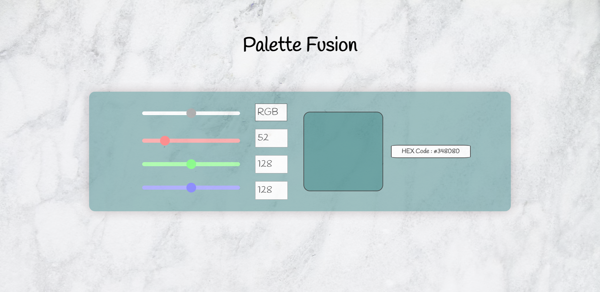
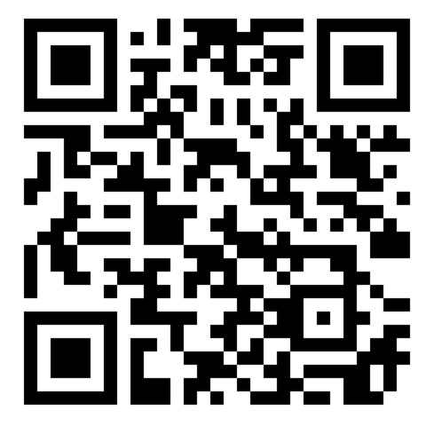

# Palette-Fusion
<h2 align="center">
 Color Blender WebApp  
 <!-- <a href="https://ehtisha-palettefusion.netlify.app/" target="_blank">ehtisham-ali6393</a> -->
</h2>

  
   

 

🎨 Welcome to Palette Fusion 🌈 - The Ultimate RGB Color Mixer!

Palette Fusion is an open-source web application designed to bring the world of colors to your fingertips. Built for artists, designers, developers, and color enthusiasts alike, this platform allows you to explore, create, and blend RGB colors with unparalleled ease and precision.

### Features:
- **RGB Sliders**: Adjust Red, Green, and Blue components within the range of 0-255 to find your perfect hue.
- **Hex Code Generator**: Get the hexadecimal code of your custom color for easy copying and pasting into your projects.
- **Intuitive Design**: A user-friendly interface that makes color mixing accessible to everyone, from professionals to hobbyists.
- **Learning Tool**: An excellent resource for educational purposes, helping users understand color theory and the RGB color model in a practical way.

### Use Cases:
- **Design & Branding**: Generate unique color palettes for logos, websites, and marketing materials.
- **Digital Art & Illustration**: Experiment with color combinations for your digital creations.
- **Web Development & UI/UX Design**: Fine-tune UI elements with the perfect colors to enhance user experience.
- **Education**: A hands-on tool for students learning about digital design and color theory.

### Contributing:
Palette Fusion thrives on community contributions! Whether it's improving the code, designing UI enhancements, or suggesting new features, your input is valuable. 

### Get Started:
Dive into the world of color mixing with Palette Fusion today. Don't forget to star me on GitHub if you find this project useful!

Happy color mixing! 🖌️

## Built With
This project was built using these technologies.

- HTML5
- CSS3
- JavaScript
- VsCode
  
### Connect with us:
- [Twitter](https://twitter.com/Ehtisha73084186)
- [LinkedIn](www.linkedin.com/in/ehtisham-ali-4a19831a0)

- [Project Demo](https://ehtisha-palettefusion.netlify.app/)
- Or Scan This QR to visit my website.

  

 

Thank you for visiting my personal portfolio. Let's connect and create something amazing together!

